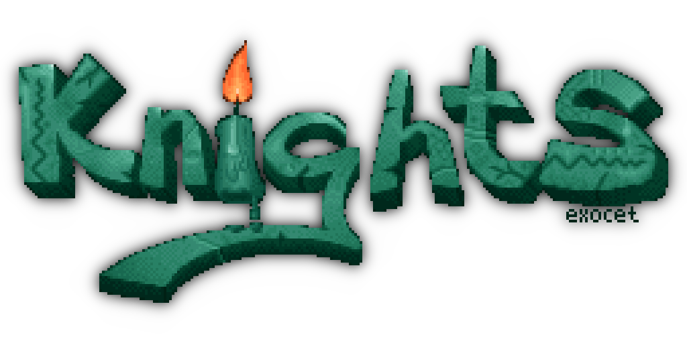

# KNIGHTS Demos

[KNIGHTS](https://knights.untergrund.net/) is a French PC [demoscene](https://en.wikipedia.org/wiki/Demoscene) group founded in 1996, mostly inactive since 2004. This repository contains modern ports, rebuilds, and source releases of their productions.

## Productions

| Directory | Production | Year | Language | Graphics | Status |
|---|---|---|---|---|---|
| [`cochlea_gl/`](cochlea_gl/) | Cochlea (OpenGL port) | 2025 | C++ | OpenGL/SDL2 | ✅ Builds & runs |
| [`cochlea/`](cochlea/) | Cochlea (original) | 1999 | C++ | Direct3D 6.0 | Win32 (VS6) |
| [`sc2/`](sc2/) | Schtroumpf 2.0 | 2004 | C | SDL+OpenGL | autotools |
| [`kawaii/`](kawaii/) | Kawaii | 2004 | C | SDL+OpenGL | autotools |
| [`khristmas/`](khristmas/) | Khristmas | 2007 | C++ | SDL (software) | Makefile |
| [`mindlink/`](mindlink/) | MindLink | 1997/2009 | C | Allegro+SDL | Makefile |
| [`styler/`](styler/) | Styler | 1998 | C | Allegro+SDL | Makefile |
| [`styler2/`](styler2/) | Styler II | 1998 | C | Allegro+SDL | Makefile |

## Credits

**Programming:** Aksel, Babaorum, Eclipse, Kassoulet (aka Impulse), Oversleeper, Tigrou

**Music:** Black Widow, Kboy, Logic Dream

**Graphics:** Bul, Marblemad, Stuff, Webep

## License

Individual productions may have their own licensing terms. See respective directories for details.
